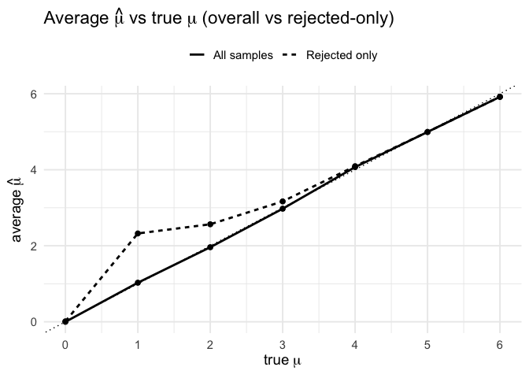
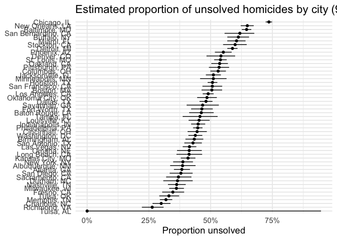

yz4982_HW5
================

## Problem 1

### Birthday paradox

For group sizes n = 2, 3, …, 50, simulate 10000 groups of n birthdays,
check if any duplicates exist, and estimate P(at least one shared
birthday) by the sample mean. Then plot probability vs group size and
comment.

### Function to test for duplicate birthdays

``` r
set.seed(20251106)

has_duplicate_bday <- function(n) {
  # Draw n birthdays 1 to 365 with replacement
  bdays <- sample(1:365, size = n, replace = TRUE)
  length(unique(bdays)) < n
}

# Quick checks
has_duplicate_bday(2)
```

    ## [1] FALSE

``` r
has_duplicate_bday(50)
```

    ## [1] TRUE

### Run 10,000 simulations per n = 2..50

``` r
sim_tbl <- map_dfr(2:50, \(n) {
  tibble(
    n = n,
    dup = replicate(10000, has_duplicate_bday(n))
  )
}) |>
  group_by(n) |>
  summarise(prob_shared = mean(dup), .groups = "drop")

head(sim_tbl, 10)
```

    ## # A tibble: 10 × 2
    ##        n prob_shared
    ##    <int>       <dbl>
    ##  1     2      0.0027
    ##  2     3      0.008 
    ##  3     4      0.0152
    ##  4     5      0.0234
    ##  5     6      0.0397
    ##  6     7      0.0538
    ##  7     8      0.0779
    ##  8     9      0.089 
    ##  9    10      0.118 
    ## 10    11      0.134

### Plot probability of at least one shared birthday vs group size

``` r
p1 <- ggplot(sim_tbl, aes(x = n, y = prob_shared)) +
  geom_line(linewidth = 1) +
  geom_point() +
  geom_hline(yintercept = 0.5, linetype = "dashed") +
  labs(
    title = "Birthday paradox via simulation",
    x = "Group size",
    y = "P(at least one shared birthday)"
  ) +
  scale_y_continuous(labels = percent_format(accuracy = 1)) +
  scale_x_continuous(breaks = seq(0, 50, by = 5)) +
  theme_minimal(base_size = 14)

ggsave("figs/simulation.png", p1, width = 7, height = 5, dpi = 300)
```

Using 10,000 simulations per group size n = 2 to 50 with birthdays drawn
uniformly from 1–365, the probability of at least one shared birthday
rises quickly as n increases. It crosses 50% around n = 23 and reaches =
97% by n = 50. Thus, even moderately sized groups make shared birthdays
very likely under these assumptions.

## Problem 2

### Design parameters

``` r
set.seed(20251106)

# Sample size 
n <- 30
# True SD
sigma <- 5
# Test size
alpha <- 0.05
# True means to try
mus   <- 0:6
# Number of datasets per mu
reps  <- 500
```

Run one simulation for a given true mean mu

``` r
sim_one <- function(mu) {
  x  <- rnorm(n, mean = mu, sd = sigma)
  tt <- t.test(x, mu = 0)
  td <- broom::tidy(tt)
  tibble(
    mu       = mu,
    estimate = td$estimate,
    pval     = td$p.value
  )
}
```

Repeat for each mu (0..6), with 5000 datasets each

``` r
sim_res <- map_dfr(mus, function(mu) {
  map_dfr(1:reps, ~ sim_one(mu))
})
```

Summaries by mu

``` r
sum_tbl <- sim_res |>
  group_by(mu) |>
  summarize(
    power            = mean(pval < alpha),
    mean_hat_overall = mean(estimate),
    mean_hat_reject  = mean(estimate[pval < alpha]),
    .groups = "drop"
  )
```

### Plot 1 power vs true mean

``` r
p_power <- ggplot(sum_tbl, aes(x = mu, y = power)) +
  geom_line(linewidth = 1) +
  geom_point(size = 2) +
  scale_y_continuous(labels = percent_format(accuracy = 1), limits = c(0, 1)) +
  scale_x_continuous(breaks = mus) +
  labs(
    title = "Power of one-sample t-test (n = 30, sd = 5, alpha = 0.05)",
    x = expression(true~mu),
    y = "Power (Pr(reject H[0]))"
  ) +
  theme_minimal(base_size = 14)

p_power
```

<!-- -->

``` r
ggsave("figs/power_vs_mu.png",  p_power, width = 7, height = 5, dpi = 300)
```

### Plot 2 Average hat mu vs true mean

``` r
plot_df <- sum_tbl |>
  select(mu,
         `All samples`   = mean_hat_overall,
         `Rejected only` = mean_hat_reject) |>
  pivot_longer(-mu, names_to = "type", values_to = "avg_hat")

p_means <- ggplot(plot_df, aes(x = mu, y = avg_hat, linetype = type)) +
  geom_line(linewidth = 1) +
  geom_point(size = 2) +
  # identity line y = x to judge closeness to the truth
  geom_abline(slope = 1, intercept = 0, linetype = "dotted") +
  scale_x_continuous(breaks = mus) +
  labs(
    title = expression(paste("Average ", hat(mu), " vs true ", mu,
                             " (overall vs rejected-only)")),
    x = expression(true~mu),
    y = expression(average~hat(mu)),
    linetype = NULL
  ) +
  theme_minimal(base_size = 14) +
  theme(legend.position = "top")

p_means
```

<!-- -->

``` r
ggsave("figs/meanhat_vs_mu.png", p_means, width = 7, height = 5, dpi = 300)
```

## Problem 3

### Import data

``` r
path <- "data/homicide-data.csv"
homi_raw <- readr::read_csv(path, show_col_types = FALSE)

dim(homi_raw) 
```

    ## [1] 52179    12

``` r
names(homi_raw)
```

    ##  [1] "uid"           "reported_date" "victim_last"   "victim_first" 
    ##  [5] "victim_race"   "victim_age"    "victim_sex"    "city"         
    ##  [9] "state"         "lat"           "lon"           "disposition"

``` r
glimpse(homi_raw) 
```

    ## Rows: 52,179
    ## Columns: 12
    ## $ uid           <chr> "Alb-000001", "Alb-000002", "Alb-000003", "Alb-000004", …
    ## $ reported_date <dbl> 20100504, 20100216, 20100601, 20100101, 20100102, 201001…
    ## $ victim_last   <chr> "GARCIA", "MONTOYA", "SATTERFIELD", "MENDIOLA", "MULA", …
    ## $ victim_first  <chr> "JUAN", "CAMERON", "VIVIANA", "CARLOS", "VIVIAN", "GERAL…
    ## $ victim_race   <chr> "Hispanic", "Hispanic", "White", "Hispanic", "White", "W…
    ## $ victim_age    <chr> "78", "17", "15", "32", "72", "91", "52", "52", "56", "4…
    ## $ victim_sex    <chr> "Male", "Male", "Female", "Male", "Female", "Female", "M…
    ## $ city          <chr> "Albuquerque", "Albuquerque", "Albuquerque", "Albuquerqu…
    ## $ state         <chr> "NM", "NM", "NM", "NM", "NM", "NM", "NM", "NM", "NM", "N…
    ## $ lat           <dbl> 35.09579, 35.05681, 35.08609, 35.07849, 35.13036, 35.151…
    ## $ lon           <dbl> -106.5386, -106.7153, -106.6956, -106.5561, -106.5810, -…
    ## $ disposition   <chr> "Closed without arrest", "Closed by arrest", "Closed wit…

Each row is one homicide case in a large U.S. city 52,179 rows, 12
columns, with fields for reported date, victim name/age/sex/race,
city/state, latitude/longitude, and case disposition.

### Generate “city_state” and summarize the “total number / number of unsolved cases” at the city level.

``` r
homi <- homi_raw |>
  mutate(
    city_state = paste(city, state, sep = ", "),
    unsolved   = disposition %in% c("Closed without arrest", "Open/No arrest")
  )

city_summary <- homi |>
  group_by(city_state) |>
  summarise(
    total    = n(),
    unsolved = sum(unsolved),
    .groups  = "drop"
  ) |>
  arrange(desc(total))

head(city_summary, 10)
```

    ## # A tibble: 10 × 3
    ##    city_state       total unsolved
    ##    <chr>            <int>    <int>
    ##  1 Chicago, IL       5535     4073
    ##  2 Philadelphia, PA  3037     1360
    ##  3 Houston, TX       2942     1493
    ##  4 Baltimore, MD     2827     1825
    ##  5 Detroit, MI       2519     1482
    ##  6 Los Angeles, CA   2257     1106
    ##  7 St. Louis, MO     1677      905
    ##  8 Dallas, TX        1567      754
    ##  9 Memphis, TN       1514      483
    ## 10 New Orleans, LA   1434      930

Extract the estimated values and confidence intervals

``` r
balt <- city_summary |> filter(city_state == "Baltimore, MD")

# Number of successes = Number of unsolved cases
balt_test <- prop.test(x = balt$unsolved, n = balt$total)
balt_tidy <- broom::tidy(balt_test) |>
  transmute(
    city_state = "Baltimore, MD",
    estimate, conf.low, conf.high
  )

balt_tidy
```

    ## # A tibble: 1 × 4
    ##   city_state    estimate conf.low conf.high
    ##   <chr>            <dbl>    <dbl>     <dbl>
    ## 1 Baltimore, MD    0.646    0.628     0.663

``` r
city_results <- city_summary |>
  mutate(
    test = purrr::map2(unsolved, total, ~ prop.test(.x, .y)),
    tidy = purrr::map(test, broom::tidy)
  ) |>
  select(city_state, tidy) |>
  unnest(tidy) |>
  select(city_state, estimate, conf.low, conf.high) |>
  arrange(estimate)
```

    ## Warning: There was 1 warning in `mutate()`.
    ## ℹ In argument: `test = purrr::map2(unsolved, total, ~prop.test(.x, .y))`.
    ## Caused by warning in `prop.test()`:
    ## ! Chi-squared approximation may be incorrect

``` r
head(city_results)
```

    ## # A tibble: 6 × 4
    ##   city_state    estimate conf.low conf.high
    ##   <chr>            <dbl>    <dbl>     <dbl>
    ## 1 Tulsa, AL        0        0         0.945
    ## 2 Richmond, VA     0.263    0.223     0.308
    ## 3 Charlotte, NC    0.300    0.266     0.336
    ## 4 Memphis, TN      0.319    0.296     0.343
    ## 5 Tulsa, OK        0.331    0.293     0.371
    ## 6 Fresno, CA       0.347    0.305     0.391

The proportion of unsolved cases in each city and the 95% confidence
interval

``` r
city_results |>
  mutate(city_state = forcats::fct_reorder(city_state, estimate)) |>
  ggplot(aes(x = city_state, y = estimate)) +
  geom_point() +
  geom_errorbar(aes(ymin = conf.low, ymax = conf.high), width = 0.15) +
  coord_flip() +
  scale_y_continuous(labels = percent_format(accuracy = 1)) +
  labs(
    title = "Estimated proportion of unsolved homicides by city (95% CI)",
    x = NULL, y = "Proportion unsolved"
  ) +
  theme_minimal(base_size = 14)
```

<!-- -->
